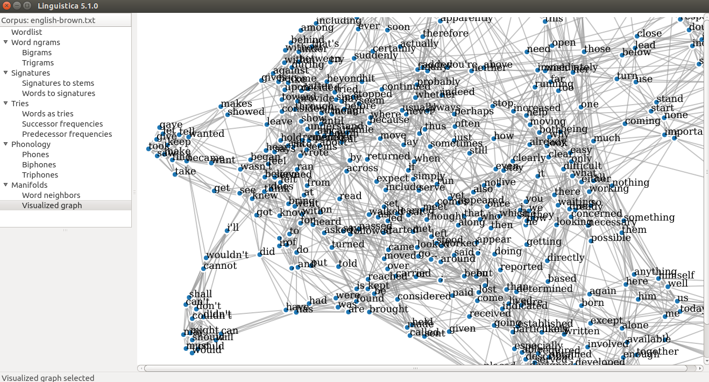

.. _index:

Linguistica 5
=============

Linguistica 5 is a Python library for unsupervised learning of linguistic
structure, based on Goldsmith (2001, 2006) and all subsequent developments.

Linguistica 5 is available in three modes:

* Python library
* Graphical user interface (GUI)
* Command line interface (CLI)

The GUI and CLI modes use the Python library as the backend.

Citation
--------

If you use Linguistica 5, please cite this paper::

   @InProceedings{lee-goldsmith:2016:lxa5,
     author    = {Lee, Jackson L. and Goldsmith, John A.},
     title     = {Linguistica 5: Unsupervised Learning of Linguistic Structure},
     booktitle = {Proceedings of the 2016 Conference of the North American Chapter of the Association for Computational Linguistics},
     month     = {June},
     year      = {2016},
     address   = {San Diego, California},
     publisher = {Association for Computational Linguistics},
     pages     = {22--26},
     url       = {http://www.aclweb.org/anthology/N16-3005}
   }

Technical support
-----------------

Please `open issues <https://github.com/linguistica-uchicago/lxa5/issues/new>`_
for questions and bug reports.
Alternatively, please feel free to contact
`Jackson Lee <http://jacksonllee.com/>`_ and
`John Goldsmith <http://people.cs.uchicago.edu/~jagoldsm/>`_.

Documentation
-------------

.. toctree::
   :maxdepth: 2

   download
   demo
   data
   read
   gui
   cli
   lexicon
   dev
   codebase
